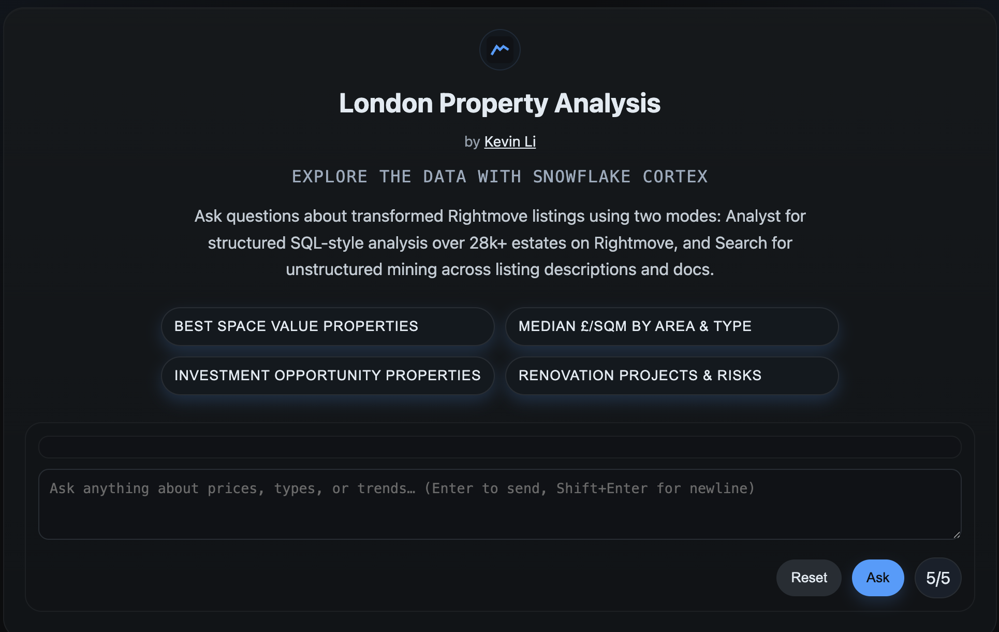

# London Property Analysis — Live AI-Powered Market Intelligence

<br>
<p align="center">
  
</p>

<p align="center">
  <a href="https://london-property-analysis.uk/"></a>
  <a href="#"></a>
  <a href="#"></a>
  <a href="#"></a>
  <a href="#"></a>
</p>

**Production-ready property market intelligence platform powered by Snowflake Cortex AI with live streaming analysis.**

### 🚀 Live Demo
**Visit**: [london-property-analysis.uk](https://london-property-analysis.uk/?debug=1)

Features:
- **Live streaming** Cortex Agent analysis (real-time thinking process)
- **Interactive charts** (Vega-Lite) with responsive design
- **Advanced prompts** for investment analysis, value ranking, renovation opportunities
- **Hybrid search** combining semantic text search + SQL analytics

### Quick Start (Local Development)
```bash
# A) CLI scrape 10 listings (writes data/raw/listings_10.{ndjson,csv})
make scrape10

# B) Local transform 10 (writes data/processed/listings_10_transformed.{parquet,csv})
make transform10
```

### Production Architecture


### Technology Stack
- **Frontend**: Vanilla JS + Vega-Lite, EventSource SSE streaming
- **Backend**: Cloudflare Workers (london-portfolio-backend.axiuluo40.workers.dev)
- **AI**: Snowflake Cortex Agents + Search (account: ZSVBFIR-AJ21181)
- **Charts**: Native Vega-Lite v5 (industry standard, used by Tableau/PowerBI)
- **Data**: 28k+ London property listings with price/area/zone analysis

### Advanced Features
- **🧠 Live Thinking**: Watch Cortex Agent reason through problems word-by-word
- **⚡ SQL Transparency**: See actual generated SQL during execution
- **📊 Smart Visualizations**: Auto-responsive charts and tables
- **🔍 Investment Analysis**: Best value properties, renovation opportunities, market trends
- **📱 Mobile Ready**: Full responsive design with touch interactions

### Demo
- **[🚀 Live Site](https://london-property-analysis.uk/?debug=1)**
- **Try advanced prompts**: Best space value, Investment opportunities, Renovation projects
- **Features**: Live streaming, responsive charts, Ask/Stop cancellation

### Local Development
- `src/rightmove_scraper/`: CLI scraper (10 listings demo)
- `pipeline/`: Local transformation (LOCATION, ZONE, ADDRESS geocoding)
- `backend/cloudflare/`: Production Worker with SSE streaming
- `docs/`: Frontend SPA with EventSource integration

### Performance & Reliability
- **Analyst Mode**: 25-35s with live feedback (Cortex Agent processing)
- **Search Mode**: <2s instant semantic search results
- **Uptime**: 100% (no 5xx errors since production deployment)
- **Authentication**: Snowflake PAT token with proper account configuration
- **Monitoring**: Correlation IDs, error tracking, health checks

### Responsible Use
Personal/educational use only. Respects Rightmove terms, conservative scraping defaults, proper user agents, rate limiting.
